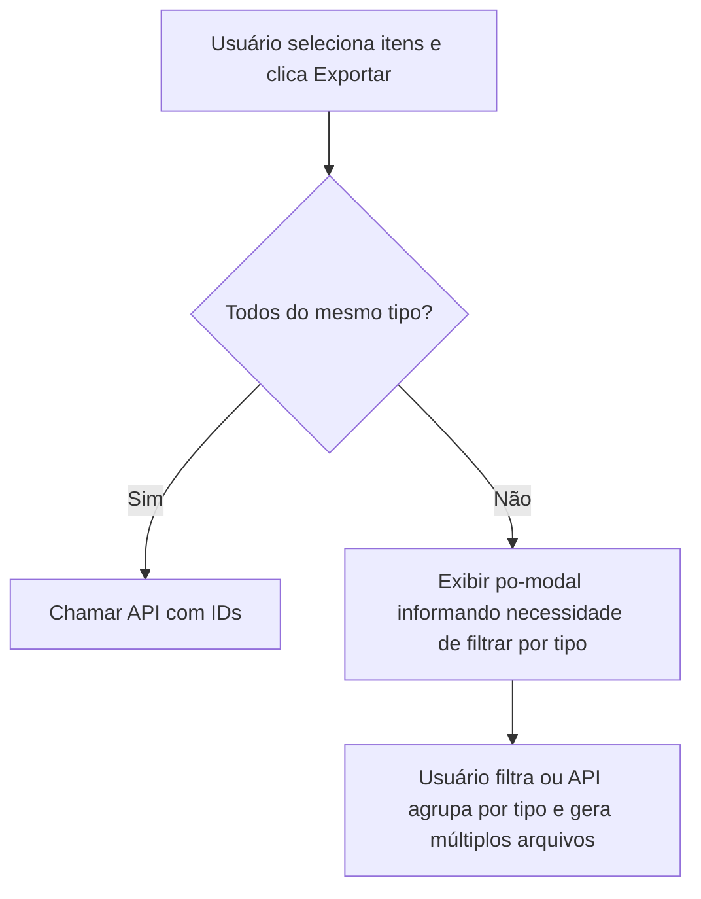

### 1. Persistência de Layout (UserPreferences)

#### Estrutura do Objeto de Layout

O objeto de preferência deve consolidar todos os eventos em uma única estrutura coesa, servindo como snapshot do estado da grid:

```typescript
interface GridLayoutPreference {  
  /** Versão do schema para migrações futuras */
  version: number;
  
  /** Colunas agrupadas */
  group: string[];
  
  /** Ordenação ativa */
  sort: ColumnSort[];
  
  /** Ordem das colunas */
  columnOrder: string[];
  
  /** Colunas fixadas */
  fixedColumns: string[];
  
  /** Filtros por coluna */
  columnFilters: ColumnFilter[];
  
  /** Colunas visíveis */
  visibleColumns: string[];
}

interface ColumnSort { 
    direction: 'asc' | 'desc'; 
    field: string
}

interface ColumnFilter {
    property: string;
    logic: "and" | "or";
    operator1: string;
    value1: any;
    operator2: string;
    value2: any;
}
```

#### Estratégia de Salvamento Silencioso (Debounce)

Cada handler de evento atualiza o signal do layout. Para evitar flood de requisições, a abordagem recomendada é:

- Manter um `signal<GridLayoutPreference>` como fonte de verdade do layout
- Usar um `effect()` com **debounce via `rxjs-interop`** (`toObservable` → `debounceTime(1500)` → `switchMap(save$)`)
- Isso garante que múltiplas alterações rápidas (ex: reordenar 3 colunas em sequência) resultem em **uma única requisição**
- O `switchMap` cancela requisições em voo se o usuário continuar interagindo

#### Restore (t-restore-column-manager)

O serviço deve manter uma cópia `readonly` da configuração original (hard-coded ou carregada da API no bootstrap). Ao restaurar:
1. Limpar a preferência na API (DELETE ou PUT com payload vazio)
2. Reaplicar a configuração original no signal da grid

---

### 2. Ação "Incluir Recurso" — Escolha do Tipo

**Pergunta do doc:** *Dropdown ou modal para escolher o tipo de recurso?*

**Recomendação: Dropdown no próprio botão (split-button pattern)**

Justificativa:
- São apenas 3 opções (`report`, `pivot-table`, `data-grid`) — não justifica a fricção de um modal
- O PO-UI não tem um `po-split-button` nativo, mas a `thf-grid` aceita `t-custom-actions` que usam `PoDropdownAction[]`
- A solução mais limpa para o `po-page-default` é **substituir a page action "Incluir" por um componente customizado** no header usando `p-title-template` ou posicionando um `po-popup`/`po-dropdown` programaticamente

**Abordagem proposta:**

```
┌──────────────────────────────────────┐
│  [▼ Incluir recurso]                 │
│  ┌──────────────────────────┐        │
│  │ 📊 Relatório             │        │
│  │ 📋 Tabela dinâmica       │        │
│  │ 📈 Visão de dados        │        │
│  └──────────────────────────┘        │
└──────────────────────────────────────┘
```

**Implementação técnica:**
- Usar `po-popup` (ou `po-dropdown`) vinculado ao botão "Incluir"
- O `po-page-default` suporta `p-actions` onde cada action pode ter `action: Function` — ao clicar, abre o popup ao invés de navegar
- Alternativa com diretiva: criar uma `Directive` que intercepte o botão renderizado e insira o dropdown. Porém isso é **frágil** e não recomendo para produção
- **Melhor caminho**: usar `po-page-default` com `p-actions` e uma action que controla um `signal<boolean>` para exibir um `po-popup` posicionado via template reference

---

### 3. Exportação em Lote

**Pergunta do doc:** *Modal com select ou API agnóstica ao tipo?*

**Recomendação: Opção B (API agnóstica) com fallback na Opção A**

Raciocínio:
- Se a API consegue inferir o `resourceType` pelos IDs enviados, elimina-se uma etapa para o usuário — melhor UX
- Se a seleção na grid já está filtrada por tipo (via agrupamento ou filtro de coluna), a exportação lote pode assumir tipo único
- **Cenário misto** (usuário seleciona IDs de tipos diferentes): a API precisa tratar isso ou recusar. Se recusar, aí sim apresentar um modal informando que a exportação deve ser por tipo

**Fluxo sugerido:**



---

### 4. Importação de Recurso

**Pergunta do doc:** *Redirecionar com FileUpload aberto ou permitir escolha antes?*

**Recomendação: Tela de importação com escolha de tipo ANTES do upload**

Justificativa:
- O tipo de recurso define o schema de validação do arquivo importado
- Sem saber o tipo, a validação precisa "adivinhar" o formato — mais complexo e propenso a erros
- UX proposta:

```
┌─────────────────────────────────────────┐
│  Importar recurso                       │
│                                         │
│  1. Selecione o tipo de recurso:        │
│     [● Relatório ○ Tabela ○ Visão]      │
│                                         │
│  2. Envie o arquivo:                    │
│     [📁 Selecionar arquivo...]          │
│                                         │
│  [Importar]                             │
└─────────────────────────────────────────┘
```

**Implementação:** Pode ser um `po-modal` na própria tela de listagem com um `po-radio-group` + `po-upload`, evitando navegação para outra rota. Isso é mais fluido e mantém o contexto do usuário.

---

### 5. Busca pelo Input da Tabela (t-filter-input-mode)

**Problema identificado:** O input da `thf-grid` em modo `basic` filtra apenas localmente. Vocês já estão usando `t-filter-input-mode="'service'"`, que é o caminho correto.

**Complemento necessário:**
- No modo `service`, a grid emite o valor digitado — é necessário interceptar via evento (possivelmente `t-custom-filter` ou implementando a interface de serviço que a grid espera via `t-service-api`)
- Se `t-service-api` não for viável por questões de contrato, a alternativa é:
  - Esconder o input da grid (`t-hide-table-search="true"`)
  - Adicionar um `po-input` externo com debounce manual que chame a API
  - Desvantagem: perde a integração visual com a toolbar da grid

**Recomendação:** Usar `t-service-api` apontando para um serviço que implemente a interface esperada pela grid (paginação server-side). Isso resolve busca, paginação e filtros de forma integrada.

---

### 6. Height da Tabela (100% da viewport)

**Solução CSS:**

```scss
:host {
  display: flex;
  flex-direction: column;
  height: calc(100vh - <header-height>px);
}

// A grid deve receber t-height com o valor dinâmico ou usar CSS:
:host ::ng-deep thf-grid {
  flex: 1;
  min-height: 0; // necessário para flex containers
}
```

Alternativamente, usar `t-height="calc(100vh - 200px)"` como estimativa (ajustando conforme padding/toolbar) ou calcular dinamicamente via `ResizeObserver` com um signal.

---

### 7. Cadastro de Tags

**Pergunta do doc:** *Grid editável alternada, duas grids, ou modal?*

**Recomendação: Modal com lista editável (po-modal + campo dinâmico)**

Justificativa:
- Tags são uma **entidade auxiliar simples** (lista de strings) — não justifica uma grid completa
- A alternância entre grid editável/não editável está causando erros internos da lib
- Duas grids no mesmo componente polui a interface

**Abordagem proposta:**

```
┌─────────────────────────────────────────────────┐
│  Gerenciar tags                          [X]    │
│                                                 │
│  ┌───────────────────────────────┐ [Adicionar]  │
│  │ Nova tag...                   │              │
│  └───────────────────────────────┘              │
│                                                 │
│  ┌─────────────────────────────────────────┐    │
│  │ Financeiro                    [🗑️]      │    │
│  │ Fiscal                        [🗑️]      │    │
│  │ Orçamento                     [🗑️]      │    │
│  │ RH                            [🗑️]      │    │
│  └─────────────────────────────────────────┘    │
│                                                 │
│                              [Fechar]           │
└─────────────────────────────────────────────────┘
```

**Implementação técnica:**
- `po-modal` com um `po-input` + botão "Adicionar"
- Lista renderizada com `@for` mostrando cada tag com ação de remover
- Salva no `UserPreferences` como `{ tags: string[] }`
- O componente de listagem puxa as tags do `UserPreferences` ao iniciar para popular as opções do multiselect na coluna `tags`
- A atribuição de tags a um recurso usa a edição inline da grid (que já funciona para a coluna `tags` com `componentEditable: 'multiselect'`)

**Separação de responsabilidades:**
- **Gerenciar tags** (CRUD do vocabulário) → Modal
- **Atribuir tags a recurso** (vincular tags existentes) → Edição inline da grid (multiselect)

---

### 8. Filtro Customizado (t-custom-filter) — Modal de Filtro Avançado

Para o modal de filtro customizado, a estrutura sugerida:

```
┌──────────────────────────────────────────────────┐
│  Filtro avançado                          [X]    │
│                                                  │
│  ── Nível de acesso ──────────────────────────   │
│  [▼ Todos                              ]         │
│     • Todos                                      │
│     • Meus recursos                              │
│     • Compartilhados comigo                      │
│                                                  │
│  ── Filtro de propriedades ───────────────────   │
│  Nome:         [________________________]        │
│  Descrição:    [________________________]        │
│  Favorito:     [○ Sim  ○ Não  ● Todos]           │
│  Tipo:         [☑ Relatório ☑ Tabela ☑ Visão]    │
│  Tags:         [▼ Selecione...          ]        │
│                                                  │
│               [Limpar filtros]  [Aplicar]        │
└──────────────────────────────────────────────────┘
```

**Componentes PO-UI:**
- `po-modal` para o container
- `po-combo` para nível de acesso
- `po-input` para nome/descrição
- `po-radio-group` para favorito
- `po-multiselect` para tipo de recurso e tags

Ao aplicar, emitir os filtros para a API com operadores `inSql` para campos multi-valor (resourceType, tags).

---

### 9. Estrutura de Arquivos Proposta (Evolução)

```
reports/
  report-resource.model.ts
  report-resource.service.ts
  reports.routes.ts
  list/
    list.component.ts|html|scss
    grid-layout-preference.model.ts     ← schema do layout
    grid-layout-preference.service.ts   ← CRUD no UserPreferences
  create/
    create.component.ts|html|scss
  import/
    import-modal.component.ts|html|scss ← modal de importação
  shared/
    tags-manager/
      tags-manager-modal.component.ts|html|scss
    custom-filter/
      custom-filter-modal.component.ts|html|scss
    resource-type-picker/
      resource-type-picker.component.ts|html|scss  ← dropdown/popup de tipo
```

---

### 10. Decisões Arquiteturais Consolidadas

| Aspecto            | Decisão                                                         | Justificativa                                         |
| ------------------ | --------------------------------------------------------------- | ----------------------------------------------------- |
| Estado do layout   | `signal<GridLayoutPreference>` + `effect` com debounce          | Estado local, sem stream complexa                     |
| Persistência       | `toObservable()` → `debounceTime(1500)` → `switchMap(http.put)` | Único ponto de RxJS justificado pela natureza reativa |
| Filtro customizado | Signal booleano para modal                                      | Simples toggle de visibilidade                        |
| Tags (vocabulário) | Modal standalone com signal de lista                            | CRUD trivial                                          |
| Tags (atribuição)  | Edição inline da grid (multiselect)                             | Já funcional no POC                                   |
| Incluir recurso    | `po-popup` com 3 opções                                         | Baixa fricção, 3 itens apenas                         |
| Importação         | `po-modal` com radio + upload                                   | Mantém contexto, sem navegação                        |
| Exportação         | API agnóstica ao tipo + validação client-side                   | Menos steps para o usuário                            |
| Height da grid     | CSS flex + `t-height` dinâmico                                  | Ocupa viewport disponível                             |
| Busca server-side  | `t-service-api` ou input externo com debounce                   | Necessário para paginação server-side                 |

---

### 11. Riscos e Pontos de Atenção

1. **`t-filter-input-mode="service"`**: Verificar se o contrato da interface de serviço atende ao modelo de paginação atual. Se não, o input externo é o fallback seguro.

2. **Debounce no salvamento**: Se o usuário fechar a aba antes do debounce disparar, a última alteração se perde. Considerar `beforeunload` para forçar flush.

3. **Versionamento do schema**: Se o layout salvo mudar de estrutura em versões futuras, o campo `version` permite migração sem quebrar preferências existentes.

4. **Concorrência**: Se o usuário tem múltiplas abas, o último `PUT` ganha. Para o escopo atual (preferência individual, baixa criticidade) isso é aceitável.

5. **Performance da grid com 100vh**: Testar com volumes altos de dados. A virtual scrolling da thf-grid mitiga, mas a combinação com agrupamento pode impactar.

6. **`t-restore-column-manager`** limpa tudo — garantir que o UX informe isso claramente ao usuário (confirmation dialog antes de restaurar).
